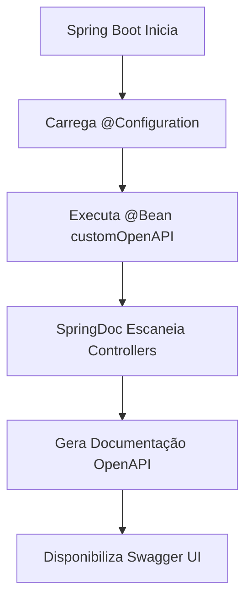

# 📚 Documentação Swagger/OpenAPI - Sistema DoeSangue

**Versão:** v1.0  
**Data:** 27 de Agosto de 2025  
**Framework:** Spring Boot 3.5.5 + SpringDoc OpenAPI

---

## 📋 Índice

1. [Visão Geral](#visão-geral)
2. [Configuração Atual](#configuração-atual)
3. [Como Funciona](#como-funciona)
4. [Dependências](#dependências)
5. [Configurações Avançadas](#configurações-avançadas)
6. [Exemplos de Uso](#exemplos-de-uso)
7. [Endpoints de Acesso](#endpoints-de-acesso)
8. [Boas Práticas](#boas-práticas)

---

## 🎯 Visão Geral

O **Swagger/OpenAPI** é uma ferramenta essencial para documentação automática de APIs REST. No projeto DoeSangue, utilizamos o **SpringDoc OpenAPI 3** para:

- 📖 **Documentação Automática:** Gera documentação interativa das APIs
- 🧪 **Testes Integrados:** Interface para testar endpoints diretamente
- 📋 **Validação de Contratos:** Valida requests/responses automaticamente  
- 🔄 **Sincronização:** Documentação sempre atualizada com o código
- 🌐 **Padrão da Indústria:** OpenAPI 3.0 é o padrão mundial para APIs

---

## ⚙️ Configuração Atual

### **📄 Arquivo: `Swagger.java`**

```java
package com.faculdade.doesangue_api.swagger;

import io.swagger.v3.oas.models.OpenAPI;
import io.swagger.v3.oas.models.info.Info;
import org.springframework.context.annotation.Bean;
import org.springframework.context.annotation.Configuration;

@Configuration
public class Swagger {

    @Bean
    public OpenAPI customOpenAPI() {
        return new OpenAPI()
                .info(new Info()
                        .title("API Doe Sangue")
                        .version("v1")
                        .description("API para gerenciamento de doações de sangue"));
    }
}
```

### **🔧 Análise da Configuração:**

#### **@Configuration**
- **O que faz:** Marca a classe como configuração Spring
- **Resultado:** Spring carrega automaticamente ao inicializar

#### **@Bean**
- **O que faz:** Registra o método como um bean Spring
- **Resultado:** OpenAPI fica disponível para toda aplicação

#### **OpenAPI().info()**
- **title:** Nome da API exibido na documentação
- **version:** Versão da API (importante para versionamento)
- **description:** Descrição detalhada da API

---

## 🚀 Como Funciona

### **1. Processo de Inicialização:**



### **2. Fluxo de Documentação Automática:**

1. **Escaneamento:** SpringDoc busca por classes anotadas com `@RestController`
2. **Análise:** Examina métodos com `@GetMapping`, `@PostMapping`, etc.
3. **Extração:** Coleta informações de parâmetros, responses, DTOs
4. **Geração:** Cria especificação OpenAPI 3.0 JSON/YAML
5. **Interface:** Renderiza Swagger UI interativa

### **3. Auto-Detecção de Endpoints:**

```java
@RestController
@RequestMapping("/api/doadores")
public class DoadorController {
    
    @GetMapping
    public ResponseEntity<List<DoadorDTO>> listarDoadores() {
        // SpringDoc automaticamente detecta:
        // - URL: GET /api/doadores
        // - Response: List<DoadorDTO>
        // - Status: 200 OK
    }
    
    @PostMapping
    public ResponseEntity<DoadorDTO> criarDoador(@RequestBody DoadorDTO doador) {
        // SpringDoc automaticamente detecta:
        // - URL: POST /api/doadores
        // - Request Body: DoadorDTO
        // - Response: DoadorDTO
        // - Status: 201 CREATED
    }
}
```

---

## 📦 Dependências

### **POM.XML - Dependência Principal:**

```xml
<dependency>
    <groupId>org.springdoc</groupId>
    <artifactId>springdoc-openapi-starter-webmvc-ui</artifactId>
    <version>2.8.9</version>
</dependency>
```

### **📋 O que esta dependência inclui:**

- **SpringDoc Core:** Geração automática da especificação OpenAPI
- **Swagger UI:** Interface web interativa para testar APIs
- **Integration:** Integração nativa com Spring Boot 3.x
- **WebMVC Support:** Suporte completo para Spring Web MVC

### **🔄 Dependências Relacionadas:**

```xml
<!-- Para APIs REST -->
<dependency>
    <groupId>org.springframework.boot</groupId>
    <artifactId>spring-boot-starter-web</artifactId>
</dependency>

<!-- Para validação automática -->
<dependency>
    <groupId>org.springframework.boot</groupId>
    <artifactId>spring-boot-starter-validation</artifactId>
</dependency>

<!-- Para HATEOAS (links na API) -->
<dependency>
    <groupId>org.springframework.boot</groupId>
    <artifactId>spring-boot-starter-hateoas</artifactId>
</dependency>
```

---

## 🔧 Configurações Avançadas Recomendadas

### **1. Configuração Completa Melhorada:**

```java
package com.faculdade.doesangue_api.swagger;

import io.swagger.v3.oas.models.OpenAPI;
import io.swagger.v3.oas.models.info.Contact;
import io.swagger.v3.oas.models.info.Info;
import io.swagger.v3.oas.models.info.License;
import io.swagger.v3.oas.models.security.SecurityRequirement;
import io.swagger.v3.oas.models.security.SecurityScheme;
import io.swagger.v3.oas.models.servers.Server;
import io.swagger.v3.oas.models.Components;
import org.springframework.context.annotation.Bean;
import org.springframework.context.annotation.Configuration;

import java.util.List;

@Configuration
public class SwaggerConfig {

    @Bean
    public OpenAPI customOpenAPI() {
        return new OpenAPI()
                // Informações da API
                .info(new Info()
                        .title("API DoeSangue - Sistema de Gerenciamento de Doações")
                        .version("v1.0")
                        .description("""
                            API REST para gerenciamento completo de doações de sangue.
                            
                            ## Funcionalidades Principais:
                            - 🏥 Gestão de Hemocentros e Usuários
                            - 🩸 Cadastro e Gestão de Doadores  
                            - 📅 Sistema de Agendamentos
                            - 🏥 Triagem Clínica
                            - 💉 Registro de Doações
                            - 📦 Controle de Estoque de Sangue
                            - 🔔 Sistema de Notificações
                            - 📋 Auditoria LGPD
                            
                            ## Arquitetura:
                            - Spring Boot 3.5.5
                            - JPA/Hibernate
                            - SQL Server
                            - Security + JWT
                            """)
                        .contact(new Contact()
                                .name("Equipe DoeSangue")
                                .url("https://github.com/nisze/doesangue_backend"))
                        .license(new License()
                                .name("MIT License")
                                .url("https://opensource.org/licenses/MIT")))
                
                // Servidores
                .servers(List.of(
                        new Server()
                                .url("http://localhost:8080")
                                .description("Ambiente de Desenvolvimento"),
                        new Server()
                                .url("https://api.doesangue.com.br")
                                .description("Ambiente de Produção")))
                
                // Configuração de Segurança JWT
                .components(new Components()
                        .addSecuritySchemes("bearerAuth", new SecurityScheme()
                                .type(SecurityScheme.Type.HTTP)
                                .scheme("bearer")
                                .bearerFormat("JWT")
                                .description("Token JWT para autenticação")))
                
                // Aplicar segurança globalmente
                .addSecurityItem(new SecurityRequirement()
                        .addList("bearerAuth"));
    }
}
```

### **2. Configurações em application.properties:**

```properties
# Configurações SpringDoc/Swagger
springdoc.api-docs.path=/api-docs
springdoc.swagger-ui.path=/swagger-ui.html
springdoc.swagger-ui.operationsSorter=method
springdoc.swagger-ui.tagsSorter=alpha
springdoc.swagger-ui.tryItOutEnabled=true
springdoc.swagger-ui.filter=true

# Pacotes para escanear
springdoc.packages-to-scan=com.faculdade.doesangue_api.controllers

# Grupos de APIs
springdoc.group-configs[0].group=institucional
springdoc.group-configs[0].paths-to-match=/api/users/**, /api/hemocentros/**, /api/setores/**
springdoc.group-configs[1].group=doadores
springdoc.group-configs[1].paths-to-match=/api/doadores/**, /api/tipos-sanguineos/**, /api/doencas/**
springdoc.group-configs[2].group=processo-doacao
springdoc.group-configs[2].paths-to-match=/api/agendamentos/**, /api/triagens/**, /api/doacoes/**, /api/estoque/**
springdoc.group-configs[3].group=sistema
springdoc.group-configs[3].paths-to-match=/api/configs/**, /api/notificacoes/**, /api/audit/**
```

---

## 📖 Exemplos de Uso em Controllers

### **1. Controller Básico com Documentação:**

```java
@RestController
@RequestMapping("/api/doadores")
@Tag(name = "Doadores", description = "APIs para gestão de doadores de sangue")
public class DoadorController {

    @Operation(
        summary = "Listar todos os doadores",
        description = "Retorna lista paginada de doadores com filtros opcionais",
        tags = {"Doadores"}
    )
    @ApiResponses(value = {
        @ApiResponse(responseCode = "200", description = "Lista de doadores retornada com sucesso",
                content = @Content(schema = @Schema(implementation = PageDoadorDTO.class))),
        @ApiResponse(responseCode = "400", description = "Parâmetros inválidos"),
        @ApiResponse(responseCode = "401", description = "Não autorizado"),
        @ApiResponse(responseCode = "403", description = "Acesso negado")
    })
    @GetMapping
    public ResponseEntity<Page<DoadorDTO>> listarDoadores(
            @Parameter(description = "Número da página (0-based)", example = "0")
            @RequestParam(defaultValue = "0") int page,
            
            @Parameter(description = "Tamanho da página", example = "20")  
            @RequestParam(defaultValue = "20") int size,
            
            @Parameter(description = "Nome para filtro", example = "João")
            @RequestParam(required = false) String nome,
            
            @Parameter(description = "Tipo sanguíneo para filtro", example = "O+")
            @RequestParam(required = false) String tipoSanguineo) {
        
        // Implementação...
    }

    @Operation(
        summary = "Criar novo doador",
        description = "Cadastra um novo doador no sistema"
    )
    @ApiResponses(value = {
        @ApiResponse(responseCode = "201", description = "Doador criado com sucesso"),
        @ApiResponse(responseCode = "400", description = "Dados inválidos"),
        @ApiResponse(responseCode = "409", description = "CPF já cadastrado")
    })
    @PostMapping
    public ResponseEntity<DoadorDTO> criarDoador(
            @io.swagger.v3.oas.annotations.parameters.RequestBody(
                description = "Dados do doador a ser cadastrado",
                required = true,
                content = @Content(schema = @Schema(implementation = DoadorCreateDTO.class))
            )
            @Valid @RequestBody DoadorCreateDTO doadorDTO) {
        
        // Implementação...
    }
}
```

### **2. DTOs Documentados:**

```java
@Schema(description = "Dados do doador para exibição")
public class DoadorDTO {
    
    @Schema(description = "ID único do doador", example = "1", accessMode = Schema.AccessMode.READ_ONLY)
    private Long id;
    
    @Schema(description = "Nome completo do doador", example = "João Silva Santos", maxLength = 100)
    private String fullName;
    
    @Schema(description = "CPF do doador", example = "12345678901", pattern = "\\d{11}")
    private String cpf;
    
    @Schema(description = "Tipo sanguíneo", example = "O+", allowableValues = {"A+", "A-", "B+", "B-", "AB+", "AB-", "O+", "O-"})
    private String tipoSanguineo;
    
    @Schema(description = "Data de nascimento", example = "1990-05-15")
    @JsonFormat(pattern = "yyyy-MM-dd")
    private LocalDate birthDate;
    
    @Schema(description = "Se é primeira doação", example = "false")
    private Boolean primeiraDoacao;
    
    // Getters/Setters...
}
```

---

## 🌐 Endpoints de Acesso

### **📋 URLs Principais:**

| **Endpoint** | **Descrição** | **URL Completa** |
|--------------|---------------|------------------|
| **Swagger UI** | Interface interativa | `http://localhost:8080/swagger-ui.html` |
| **API Docs JSON** | Especificação OpenAPI | `http://localhost:8080/api-docs` |
| **API Docs YAML** | Especificação OpenAPI | `http://localhost:8080/api-docs.yaml` |

### **🔗 Grupos de APIs (após configuração avançada):**

| **Grupo** | **Descrição** | **URL** |
|-----------|---------------|---------|
| **Institucional** | Users, Hemocentros, Setores | `/swagger-ui.html?configUrl=/api-docs/swagger-config#/institucional` |
| **Doadores** | Doadores, Tipos Sanguíneos | `/swagger-ui.html?configUrl=/api-docs/swagger-config#/doadores` |
| **Processo Doação** | Agendamentos, Triagem, Doações | `/swagger-ui.html?configUrl=/api-docs/swagger-config#/processo-doacao` |
| **Sistema** | Configurações, Notificações | `/swagger-ui.html?configUrl=/api-docs/swagger-config#/sistema` |

---

## 📱 Interface Swagger UI

### **🎯 Funcionalidades da Interface:**

#### **1. Navegação:**
- **Tags/Grupos:** APIs organizadas por funcionalidade
- **Filtro:** Busca por endpoint específico
- **Expand/Collapse:** Visualização controlada

#### **2. Teste de APIs:**
- **Try it out:** Botão para testar endpoints
- **Parâmetros:** Formulário para inserir dados
- **Execute:** Execução real da API
- **Response:** Visualização de resposta e status

#### **3. Documentação:**
- **Schemas:** Visualização de DTOs
- **Examples:** Exemplos de request/response
- **Security:** Informações de autenticação

### **🔐 Autenticação na Interface:**

```javascript
// No Swagger UI, clicar em "Authorize"
// Inserir token JWT no formato:
Bearer eyJhbGciOiJIUzI1NiJ9.eyJpc3MiOiJkb2VzYW5ndWUiLCJzdWIiOiJhZG1pbiIsImV4cCI6MTY5MzQxMjQwMH0...
```

---

## 🎯 Boas Práticas

### **✅ Documentação de APIs:**

1. **Use @Operation:** Descreva cada endpoint claramente
2. **Defina @ApiResponses:** Documente todos os status codes possíveis  
3. **Anote @Parameter:** Explique cada parâmetro
4. **Schemas Completos:** Use @Schema em DTOs
5. **Exemplos Reais:** Forneça exemplos práticos

### **✅ Organização:**

1. **Tags Consistentes:** Agrupe APIs logicamente
2. **Versionamento:** Mantenha versões claras
3. **Grupos Separados:** Divida por domínio/funcionalidade
4. **Filtros:** Configure filtros úteis na interface

### **✅ Segurança:**

1. **Documente Autenticação:** Explique como autenticar
2. **Schemas de Security:** Configure JWT corretamente
3. **Ambiente Específico:** URLs diferentes por ambiente
4. **Sensitive Data:** Não exponha dados sensíveis

### **✅ Performance:**

1. **Lazy Loading:** Configure carregamento inteligente
2. **Cache:** Use cache para especificação
3. **Filtros de Scan:** Limite escaneamento a pacotes específicos
4. **Grupos Pequenos:** Divida APIs grandes

---

## 🚦 Status Atual vs Recomendado

### **❌ Configuração Atual (Básica):**
- ✅ Swagger UI funcional
- ✅ Informações básicas da API
- ❌ Sem documentação de segurança
- ❌ Sem grupos organizados
- ❌ Sem exemplos detalhados
- ❌ Sem configurações avançadas

### **✅ Configuração Recomendada:**
- ✅ Documentação completa
- ✅ Segurança JWT documentada
- ✅ APIs organizadas em grupos
- ✅ Exemplos práticos
- ✅ Múltiplos ambientes
- ✅ Schemas detalhados

---

## 🎯 Próximos Passos

### **1. Imediato:**
- [ ] Aplicar configuração avançada do Swagger
- [ ] Adicionar documentação de segurança JWT
- [ ] Configurar grupos de APIs

### **2. Desenvolvimento de Controllers:**
- [ ] Criar controllers REST para cada entidade
- [ ] Adicionar anotações de documentação
- [ ] Implementar DTOs com schemas

### **3. Otimização:**
- [ ] Configurar cache de documentação
- [ ] Adicionar testes automatizados de APIs
- [ ] Integrar com pipeline CI/CD

---

*Esta documentação fornece uma base sólida para implementação e evolução da documentação API do sistema DoeSangue usando Swagger/OpenAPI.*
