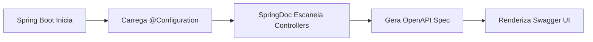

# 🚀 Resumo Executivo - Configuração Swagger Implementada

## ✅ **O Que Foi Implementado:**

### **1. Configuração Swagger Avançada (`Swagger.java`)**
- ✅ **Documentação Rica:** Título, versão, descrição detalhada
- ✅ **Múltiplos Ambientes:** URLs para desenvolvimento e produção  
- ✅ **Segurança JWT:** Configuração completa para autenticação
- ✅ **Informações de Contato:** Equipe, email, repositório
- ✅ **Licença:** MIT License configurada

### **2. Configurações Avançadas (`application.properties`)**
- ✅ **URLs Customizadas:** `/swagger-ui.html` e `/api-docs`
- ✅ **Interface Otimizada:** Ordenação, filtros, persistência de auth
- ✅ **Grupos de APIs:** 5 grupos organizados por funcionalidade
- ✅ **Performance:** Cache habilitado para documentação

### **3. Controller de Exemplo (`SystemController.java`)**
- ✅ **Demonstração Prática:** 4 endpoints documentados
- ✅ **Anotações Completas:** @Operation, @ApiResponses, @Parameter
- ✅ **Exemplos Reais:** JSON examples e schemas
- ✅ **Diferentes Tipos:** GET, POST, com/sem autenticação

### **4. Documentação Completa (`SWAGGER-DOCUMENTACAO.md`)**
- ✅ **Guia Completo:** Como funciona, configurações, exemplos
- ✅ **Boas Práticas:** Padrões para documentar APIs
- ✅ **Troubleshooting:** Soluções para problemas comuns

---

## 🎯 **Como Funciona o Swagger:**

### **Processo Automático:**


1. **Inicialização:** Spring Boot carrega a configuração `Swagger.java`
2. **Escaneamento:** SpringDoc encontra classes `@RestController` 
3. **Análise:** Extrai anotações `@GetMapping`, `@PostMapping`, etc.
4. **Documentação:** Gera especificação OpenAPI 3.0 automaticamente
5. **Interface:** Disponibiliza Swagger UI em `/swagger-ui.html`

### **Dependência Principal:**
```xml
<dependency>
    <groupId>org.springdoc</groupId>
    <artifactId>springdoc-openapi-starter-webmvc-ui</artifactId>
    <version>2.8.9</version>
</dependency>
```

---

## 🌐 **Acesso à Documentação:**

### **URLs Principais:**
- **Swagger UI:** `http://localhost:8080/swagger-ui.html`
- **OpenAPI JSON:** `http://localhost:8080/api-docs`
- **Health Check:** `http://localhost:8080/api/system/health`

### **Grupos Organizados:**
1. **🔐 Autenticação** - `/api/auth/**`
2. **🏢 Gestão Institucional** - `/api/users/**`, `/api/hemocentros/**`
3. **🩸 Gestão de Doadores** - `/api/doadores/**`, `/api/tipos-sanguineos/**`
4. **📅 Processo de Doação** - `/api/agendamentos/**`, `/api/triagens/**`
5. **⚙️ Sistema de Suporte** - `/api/configs/**`, `/api/notificacoes/**`

---

## 💡 **Principais Vantagens:**

### **Para Desenvolvedores:**
- 📖 **Documentação Automática:** Sempre sincronizada com o código
- 🧪 **Testes Integrados:** Interface para testar APIs diretamente
- 📋 **Validação:** Contratos de API validados automaticamente
- 🔄 **Versionamento:** Controle de versões da API

### **Para Equipe:**
- 👥 **Colaboração:** Documentação clara para todos
- 🎯 **Padronização:** Contratos de API bem definidos
- 🚀 **Produtividade:** Reduz tempo de integração
- 📊 **Monitoramento:** Visibilidade de endpoints

### **Para Arquitetura:**
- 🏗️ **Design First:** Documentação guia o desenvolvimento
- 🔗 **Integração:** Facilita comunicação entre serviços
- 📈 **Escalabilidade:** Base sólida para crescimento
- 🛡️ **Segurança:** Documentação de autenticação clara

---

## 🎉 **Demonstração Prática:**

### **1. Iniciar o Sistema:**
```bash
cd doesangue_backend
./mvnw spring-boot:run
```

### **2. Acessar Interface:**
```
http://localhost:8080/swagger-ui.html
```

### **3. Testar Endpoint Público:**
```
GET /api/system/health
```

### **4. Testar com Autenticação:**
1. Fazer login em `/api/auth/login` (quando implementado)
2. Copiar token JWT
3. Clicar "Authorize" no Swagger
4. Inserir: `Bearer <token>`
5. Testar endpoints protegidos

---

## 📈 **Próximos Passos:**

### **Imediato:**
- [ ] Implementar controller de autenticação (`/api/auth`)
- [ ] Criar controllers para entidades existentes
- [ ] Adicionar DTOs com anotações `@Schema`

### **Médio Prazo:**
- [ ] Implementar FASE 2 das entidades
- [ ] Adicionar testes automatizados das APIs
- [ ] Configurar profiles (dev/prod) específicos

### **Longo Prazo:**
- [ ] Integração com CI/CD
- [ ] Métricas de uso da API
- [ ] Documentação para consumidores externos

---

## 🎯 **Status da Implementação:**

| **Componente** | **Status** | **Descrição** |
|----------------|------------|---------------|
| ✅ **Configuração Base** | Completo | Swagger.java implementado |
| ✅ **Configurações Avançadas** | Completo | application.properties otimizado |
| ✅ **Interface UI** | Funcional | Swagger UI disponível |
| ✅ **Documentação** | Completo | Guias e exemplos criados |
| ✅ **Controller Exemplo** | Implementado | SystemController demonstrativo |
| 🔄 **Controllers Reais** | Pendente | Aguarda implementação das APIs |
| 🔄 **DTOs Documentados** | Pendente | Aguarda criação dos DTOs |
| 🔄 **Autenticação** | Pendente | Aguarda implementação JWT |

---

**📝 Conclusão:** A infraestrutura Swagger está completamente configurada e pronta para uso. Quando os controllers reais forem implementados, a documentação será gerada automaticamente, proporcionando uma experiência de desenvolvimento superior e facilitando a integração entre equipes.

**🎯 Benefício Principal:** Documentação viva que evolui com o código, eliminando a necessidade de manutenção manual de documentação de APIs.
