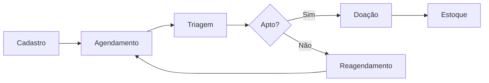
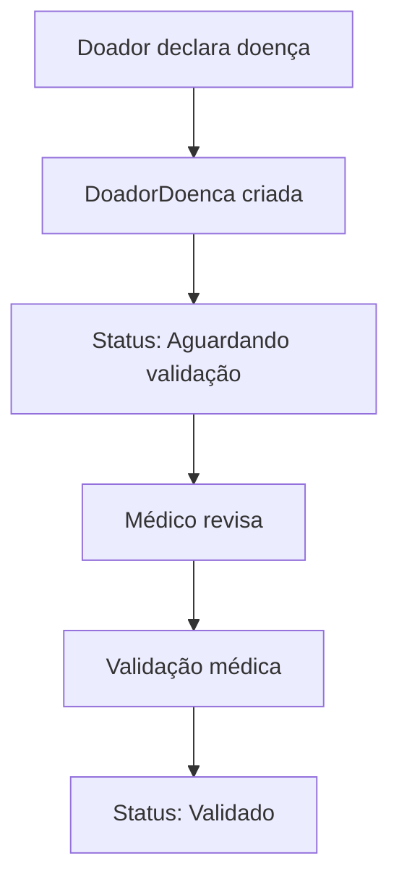
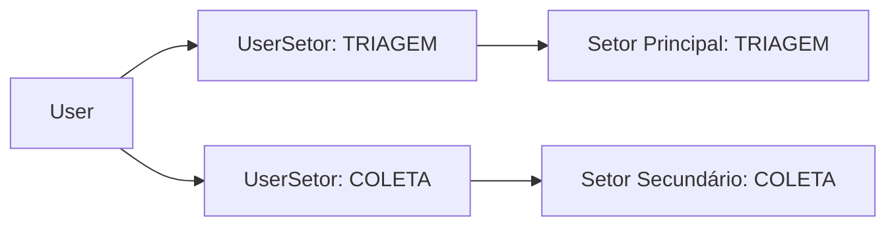

# 🏗️ Arquitetura do Sistema DoeSangue
**Versão:** v1.0  
**Data:** 27 de Agosto de 2025  

## 📋 Visão Geral

Sistema de gestão completa para doação de sangue baseado em arquitetura em camadas, seguindo rigorosamente o schema de banco de dados MVP fornecido.

## 🎯 Objetivos Arquiteturais

### Princípios de Design
- **Holistic System Thinking** - Cada componente integrado ao sistema maior
- **User Experience Drives Architecture** - Jornadas de usuário orientam decisões
- **Pragmatic Technology Selection** - Spring Boot + JPA para rapidez e confiabilidade
- **Progressive Complexity** - Inicia simples, escala conforme necessário
- **Security at Every Layer** - Defesa em profundidade
- **Data-Centric Design** - Modelo de dados orienta arquitetura

## 🏢 Arquitetura de Alto Nível

### Stack Tecnológico
```
Frontend (Futuro)
├── React/Angular/Vue.js
├── REST API Integration
└── Material-UI/Bootstrap

Backend (Atual)
├── Spring Boot 3.x
├── Spring Security 6.x
├── Spring Data JPA
├── Hibernate ORM
└── Maven

Database
├── SQL Server (Produção)
├── H2 (Desenvolvimento)
└── Connection Pool (HikariCP)

Infrastructure
├── Docker containerization
├── Azure/AWS deployment
└── CI/CD pipelines
```

## 📊 Modelo de Domínio

### Agregados Principais

#### 1. **Agregado INSTITUTIONAL** 
```
Hemocentro (Root)
├── SetorAtuacao
├── User
├── UserRole
└── UserSetor (Association)
```

#### 2. **Agregado DONOR**
```
Doador (Root)
├── TipoSanguineo
├── DoadorDoenca (Association)
├── DoencaEspecifica
└── ConsentimentoLgpd
```

#### 3. **Agregado DONATION_PROCESS**
```
Doacao (Root)
├── Agendamento
├── TriagemClinica
└── EstoqueSangue
```

#### 4. **Agregado SYSTEM_SUPPORT**
```
ConfiguracaoSistema
├── Notificacao
└── LogAuditoriaLgpd
```

## 🏛️ Arquitetura em Camadas

### Layer 1: Presentation Layer
```
📱 Controllers (REST API)
├── DoadorController
├── UserController  
├── HemocentroController
├── DoacaoController
├── TriagemController
├── EstoqueController
└── ConfigController
```

### Layer 2: Application Layer
```
🔧 Services (Business Logic)
├── DoadorService
├── TriagemService
├── DoacaoService
├── EstoqueService
├── NotificacaoService
├── ElegibilidadeService
└── AuditoriaService
```

### Layer 3: Domain Layer
```
🎯 Entities + Domain Services
├── Entities (17 entidades mapeadas)
├── Value Objects (Enums)
├── Domain Services
│   ├── CompatibilidadeSanguineaService
│   ├── ValidacaoMedicaService
│   └── ElegibilidadeDoadorService
└── Repositories (Interfaces)
```

### Layer 4: Infrastructure Layer
```
🗄️ Data Access + External Services
├── JPA Repositories
├── Database Configuration
├── External APIs (Future)
└── File Storage
```

## 🔐 Segurança Multi-Camada

### Autenticação & Autorização
```java
@Configuration
@EnableWebSecurity
public class SecurityConfig {
    
    // Role-based Access Control
    ADMINISTRADOR (Level 4) - Full system access
    MEDICO (Level 3) - Medical validation + Clinical data
    ENFERMEIRO (Level 3) - Screening + Collection
    ATENDENTE (Level 2) - Basic registration + Scheduling
    
    // Multi-sector Support
    User -> Multiple Sectors (TRIAGEM + COLETA simultaneously)
}
```

### LGPD Compliance Framework
```java
// Built-in Privacy Controls
├── ConsentimentoLgpd - Granular consent tracking
├── LogAuditoriaLgpd - Complete audit trail
├── Soft Delete - Data retention compliance
└── Data Minimization - Only necessary fields
```

## 🩸 Fluxos de Processo Críticos

### 1. **Jornada do Doador**


### 2. **Validação Médica de Doenças**


### 3. **Gestão Multi-Setor**


## 📊 Estrutura de Dados Otimizada

### Relacionamentos Principais
```sql
-- Hierarquia Institucional
Hemocentro 1:N User
User N:M SetorAtuacao (via UserSetor)

-- Dados do Doador
Doador N:1 TipoSanguineo
Doador N:M DoencaEspecifica (via DoadorDoenca)
Doador 1:N ConsentimentoLgpd

-- Processo de Doação
Doador 1:N Agendamento
Doador 1:N TriagemClinica
TriagemClinica 1:N Doacao
TipoSanguineo 1:1 EstoqueSangue
```

### Índices Estratégicos
```sql
-- Performance Crítica
CREATE INDEX IX_DOADORES_CPF ON DOADORES(CPF);
CREATE INDEX IX_DOACOES_DATA ON DOACOES(DATA_DOACAO DESC);
CREATE INDEX IX_DOADOR_DOENCAS_VALIDACAO ON DOADOR_DOENCAS(VALIDADO_POR_MEDICO);

-- Multi-Sector Queries
CREATE INDEX IX_USER_SETORES_ATIVO ON USER_SETORES(ID_USER, ATIVO);
CREATE INDEX IX_USER_SETORES_PRINCIPAL ON USER_SETORES(IS_SETOR_PRINCIPAL);
```

## 🔧 Componentes de Negócio

### Domain Services Especializados

#### 1. **ElegibilidadeService**
```java
@Service
public class ElegibilidadeService {
    
    // Verifica 95 doenças impeditivas
    public ElegibilidadeResult verificarElegibilidade(Long doadorId);
    
    // Valida critérios médicos
    public boolean validarCriteriosMedicos(TriagemClinica triagem);
    
    // Calcula próxima doação permitida
    public LocalDate calcularProximaDoacaoPermitida(Doador doador);
}
```

#### 2. **CompatibilidadeSanguineaService**
```java
@Service  
public class CompatibilidadeSanguineaService {
    
    // Lógica baseada em TipoSanguineo.podeDoarPara
    public List<TipoSanguineo> getReceptoresCompativeis(TipoSanguineo doador);
    
    // Dashboard de estoque crítico
    public EstoqueStatus avaliarEstoqueCritico();
}
```

#### 3. **ValidacaoMedicaService**
```java
@Service
public class ValidacaoMedicaService {
    
    // Workflow híbrido: Doador declara + Médico valida
    public void validarDoencaDeclarada(Long doadorDoencaId, User medico);
    
    // Detectar doenças durante triagem
    public DoadorDoenca detectarDoencaTriagem(Long triagem, DoencaEspecifica doenca);
}
```

## 📱 API Design Estratégico

### RESTful Endpoints
```java
// Doador Management
GET    /api/doadores                    // Lista paginada
POST   /api/doadores                    // Cadastro completo
GET    /api/doadores/{id}               // Detalhes + doenças
PUT    /api/doadores/{id}               // Atualização
DELETE /api/doadores/{id}               // Soft delete

// Medical Workflow
GET    /api/doadores/{id}/doencas       // Histórico médico
POST   /api/doadores/{id}/doencas       // Adicionar doença
PUT    /api/doencas/{id}/validar        // Validação médica

// Multi-Sector Management  
GET    /api/users/{id}/setores          // Setores do usuário
POST   /api/users/{id}/setores          // Adicionar setor
PUT    /api/users/{id}/setores/{setorId} // Alterar setor principal

// Donation Process
POST   /api/agendamentos                // Agendar doação
GET    /api/triagem/{doadorId}          // Triagem pendente
POST   /api/triagem                     // Registrar triagem
POST   /api/doacoes                     // Registrar doação

// Blood Inventory
GET    /api/estoque                     // Status por tipo sanguíneo
PUT    /api/estoque/{tipoId}            // Atualizar estoque
GET    /api/estoque/criticos            // Tipos em nível crítico
```

### Padrões de Response
```java
// Standard API Response
{
    "success": true,
    "data": { ... },
    "message": "Operação realizada com sucesso",
    "timestamp": "2025-08-27T10:30:00Z"
}

// Error Response
{
    "success": false,
    "error": {
        "code": "DOADOR_NOT_ELIGIBLE",
        "message": "Doador apresenta doença impeditiva: Diabetes Tipo 1",
        "details": ["ID_DOENCA: 11", "STATUS: ATIVO"]
    },
    "timestamp": "2025-08-27T10:30:00Z"
}
```

## 📊 Monitoring & Analytics

### Dashboard Metrics
```java
// Real-time KPIs
├── Doadores ativos por tipo sanguíneo
├── Estoque crítico (< nível mínimo)
├── Doações por período
├── Taxa de aprovação em triagem
├── Doenças mais prevalentes
├── Validações médicas pendentes
└── Usuários por setor (multi-sector view)
```

### LGPD Audit Trail
```java
// Compliance Tracking
├── Todas as operações em dados pessoais
├── Finalidade de cada acesso
├── Origem IP e usuário responsável
├── Consentimentos ativos/revogados
└── Relatórios de conformidade
```

## 🚀 Deployment Strategy

### Environment Configuration
```yaml
# application-prod.yml
spring:
  datasource:
    url: jdbc:sqlserver://prod-db:1433;databaseName=DB_DOESANGUE_MVP
    username: ${DB_USERNAME}
    password: ${DB_PASSWORD}
  jpa:
    hibernate:
      ddl-auto: validate  # Never auto-create in prod
  security:
    require-ssl: true

# application-dev.yml  
spring:
  datasource:
    url: jdbc:h2:mem:testdb
  jpa:
    hibernate:
      ddl-auto: create-drop
  h2:
    console:
      enabled: true
```

### Docker Configuration
```dockerfile
FROM openjdk:17-jdk-slim
COPY target/doesangue-backend.jar app.jar
EXPOSE 8080
ENTRYPOINT ["java", "-jar", "/app.jar"]
```

## 🔄 Migration Strategy

### Implementação Faseada
```
FASE 1 (2 semanas) - Core MVP
├── Entidades básicas (User, Doador, TipoSanguineo, Hemocentro)
├── Autenticação básica
└── CRUD operations

FASE 2 (3 semanas) - Medical Workflow  
├── Setores múltiplos (UserSetor)
├── Doenças e validação médica
├── Triagem e agendamentos
└── Dashboard básico

FASE 3 (2 semanas) - Advanced Features
├── Doações e estoque
├── LGPD compliance
├── Relatórios e analytics
└── Notificações

FASE 4 (1 semana) - Production Ready
├── Performance optimization
├── Security hardening
├── Monitoring integration
└── Deployment automation
```

## 🎯 Success Metrics

### Technical Metrics
- **Database Coverage:** 100% (17/17 tabelas)
- **API Response Time:** < 200ms (95th percentile)
- **System Uptime:** > 99.5%
- **LGPD Compliance:** 100% audit coverage

### Business Metrics
- **User Adoption:** Multi-sector usage tracking
- **Process Efficiency:** Triagem-to-donation conversion rate
- **Data Quality:** Medical validation completion rate
- **Operational Excellence:** Blood shortage prevention

---

## 📚 Technical Documentation

### Code Standards
- **Java 17+** with modern features
- **Spring Boot 3.x** for rapid development
- **JPA/Hibernate** for ORM
- **Maven** for dependency management
- **JUnit 5** for testing
- **SonarQube** for code quality

### Database Standards
- **Foreign Keys** enforced for referential integrity
- **Indexes** optimized for query patterns
- **Audit Columns** for all entities
- **Soft Delete** for LGPD compliance

---

*Esta arquitetura estabelece uma base sólida e escalável para o Sistema DoeSangue, respeitando totalmente o modelo de dados fornecido e preparando o terreno para crescimento futuro.*
